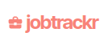
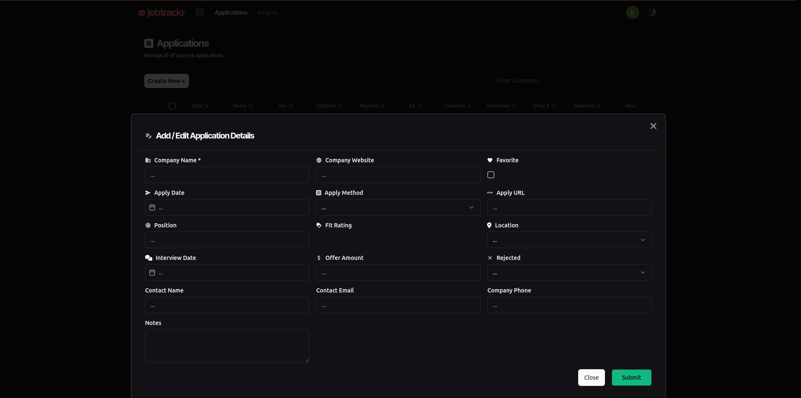

Website: https://jobtrackr.pro

## Tech Stack

- **Front End:** Next.Js | TypeScript | TailwindCSS
- **Back End:** Drizzle ORM | PostgreSQL
- **Other Libraries:** Nivo | Material UI | Shadcn UI

---

## Goal

I wanted to create a simple way to track job applications, and also view metrics and useful data visualizations in order to help the user see how effective their job hunting strategies really are.

---

## Key Features 

- Track application status. ( No Response (Ghost), Interviews, Rejections, Offers )

- Calendar chart to see how many applications you sent out each day.

- Upcoming Interviews, Pending Offers are displayed on dashboard.

- Data visualization using sankey diagram.

- Other useful metrics to help you gauge your job hunting stragies' effectiveness.

---

## What I learned

So I wanted to incorporate an ORM into this project since I've only used raw sql in the past.
I decided to go with Drizzle ORM because it was the most "SQL like", and so I thought it was a good way to get my feet wet.

Although with learning any new technology there is a slight learning curve in the beginning, I got the hang of it pretty quickly and understood why 
many developers choose to use an ORM over raw sql. It really increased my development speed and it also helped that drizzle was quite intuitive to use. 
Not having to deal with raw sql almost felt like the transition I made from building websites with pure javascript to react, or even from vanilla CSS to tailwindCSS. It really does make life easier. I AM SPEED.

---

## Project Images

Landing Page


---

**Dashboard**

At the top of the dashboard are some general metrics about the users job applications.


---

**Applications Page**

This is where you can create, edit, delete your job applications.


---

**Application Form**

Application form modal.



---


**Insights (Data Vis & Metrics)**

View insights into your applications using a Sankey Diagram.

")

---

## Setup

Installation:

```bash
git clone git@github.com:sycodes95/jobtrackr-2.git
```

Install Dependencies:
```bash
npm install
```

Running Dev Server:

```bash
npm run dev
```

Running Prod Server:

```bash
npm run build
npm start
```

Running Tests:

```bash
npm run test
```

Sync Drizzle ORM DB Schema:

```bash
npm run pgpush
```